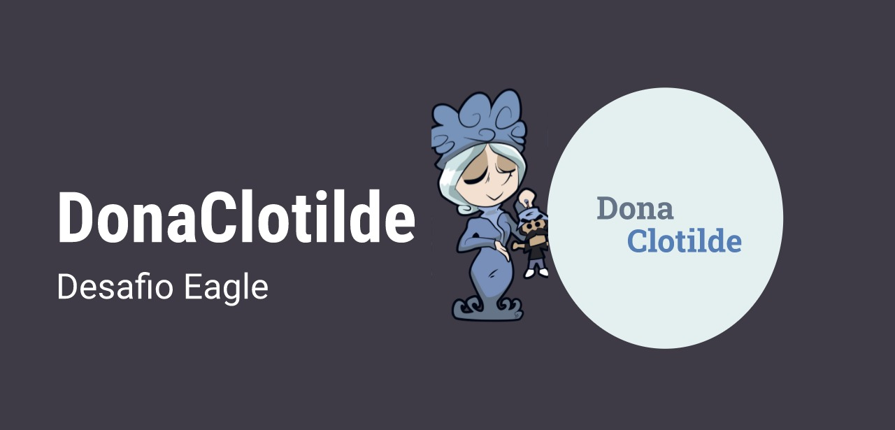

<h1 align=center>

</h1>

<div align="center">

![BADGE_WEB_REACT] ![BADGE_SERVER_NODEJS] ![BADGE_TYPESCRIPT]

</div>

<h3 align="center">

O sistema Dona Clotilde foi um projeto desenvolvido como teste para contratação na empresa Eagle Digital e foram utilizadas as tecnologias ***TypeScript, Node e ReactJS***.

</h3>

## **:rocket: OBJETIVO**

O projeto tem como finalidade auxiliar a persona "Dona Clotilde" a saber quais remédios ela e as colegas do grupo de bingo devem tomar e em qual horário.

<!--
  ...
  Local Reservado para o GIF do projeto rodando.
  ...
-->

## **:computer: TECNOLOGIAS**


#### **Website** ([React][react] + [TypeScript][typescript])

  - **[React Router Dom][react_router_dom]**
  - **[React Icons][react_icons]**
  - **Axios**


  \* Veja o arquivo <kbd>[package.json](./src/package.json)</kbd>

#### **Server** ([NodeJS][node] + [TypeScript][typescript])

  - **[Express][express]**
  - **[CORS][cors]**
  - **MariaDb**
  - **[ts-node][tsnode]**
  - - **Docker**


#### **Utilitários**

- Editor: **[Visual Studio Code][vscode]** &rarr;
- Teste de API: **[Insomnia][insomnia]**
- Ícones: **[Feather Icons][feather_icons]**
- Fontes: **[Roboto][font_roboto]**


## **:wine_glass: COMO UTILIZAR**

### Configurações Iniciais

Primeiro, você precisa ter o <kbd>[NodeJS](https://nodejs.org/en/download/)</kbd> instalado na sua máquina em versão recente.

Se você estiver utilizando o **Linux**, você pode optar por instalar o **Node** através do gerênciador de versões para facilitar o processo de mudança da versão do **Node**, quando for necessário.

Você pode optar também por utilizar o **yarn** no lugar do **npm**. Você pode instalar clicando nesse <kbd>[link][yarn]</kbd>.

O projeto foi criado utilizando Docker. Você pode instalar clicando neste <kbd>[link][docker]</kbd> ou se preferir pode usar o banco de dados MariaDb local.


Exemplos:
```sh
# Instalando as dependências do front-end
$ cd eagle-challenge/frontend
$ yarn

# Instalando as dependências do servidor:
$ cd eagle-challenge/backend
$ yarn
```

### Configurações com o banco de dados
Crie um banco de dados vazio no servidor Mariadb com o nome **eagle_challenge**.

No arquivo ormconfig alterar as credenciais de acesso ao seu banco de dados conforme as configurações da sua base de dados local.

### Utilizando o Server

```sh
# Abrindo o terminal no diretório do servidor:
$ cd eagle-challenge/backend

# Instanciando o banco de dados:
$ yarn typeorm migration:run

# Executando a aplicação em modo de desenvolvimento:
$ yarn dev:server

```

### Utilizando o Website/Frontend

```sh
# Abrindo o terminal no diretório do website:
$ cd eagle-challenge/frontend

# Executando o website no modo de desenvolvimento:
$ yarn start
```

> Se o browser não abrir automaticamente, acesse: http://localhost:3000.


**\* Lembre de alterar o IP(baseURL) para garantir comunicação com o servidor, através do arquivo api.ts, localizado em frontend/services/api.ts **
**O ip está local para ser possivel fazer testes pelo telefone. Em caso de testar apenas no navegador, o IP pode ser substituido por localhost**

## **:page_with_curl: LICENÇA**

Esse repositório está licenciado pela **MIT LICENSE**.

<h3 align="center">
Feito com ❤️ por <a href="https://www.linkedin.com/in/kimberly-tusinski-2851521b7/">Kimberly Tusinski</a>
<br><br>
</h3>


<!-- Badges -->

[BADGE_CLOSED_ISSUES]: https://img.shields.io/github/issues-closed/x0n4d0/ecoleta?color=red

[BADGE_OPEN_ISSUES]: https://img.shields.io/github/issues/x0n4d0/ecoleta?color=green

[BADGE_LICENSE]: https://img.shields.io/github/license/x0n4d0/ecoleta

[BADGE_NODE_VERSION]: https://img.shields.io/badge/node-12.17.0-green

[BADGE_NPM_VERSION]: https://img.shields.io/badge/npm-6.14.4-red

[BADGE_WEB_REACT]: https://img.shields.io/badge/web-react-blue

[BADGE_MOBILE_REACT_NATIVE]: https://img.shields.io/badge/mobile-react%20native-blueviolet

[BADGE_SERVER_NODEJS]: https://img.shields.io/badge/server-nodejs-important

[BADGE_STARS]: https://img.shields.io/github/stars/x0n4d0/ecoleta?style=social

[BADGE_FORKS]: https://img.shields.io/github/forks/x0n4d0/ecoleta?style=social

[BADGE_TYPESCRIPT]: https://badges.frapsoft.com/typescript/code/typescript.png?v=101

[BADGE_OPEN_SOURCE]: https://badges.frapsoft.com/os/v1/open-source.png?v=103

<!-- Techs -->

[react]: https://reactjs.org/

[typescript]: https://www.typescriptlang.org/

[node]: https://nodejs.org/en/

[vscode]: https://code.visualstudio.com/

[markdown_emoji]: https://gist.github.com/rxaviers/7360908

[express]: https://expressjs.com/

[cors]: https://expressjs.com/en/resources/middleware/cors.html

[tsnode]: https://github.com/TypeStrong/ts-node

[feather_icons]: https://feathericons.com/

[insomnia]: https://insomnia.rest/

[react_router_dom]: https://github.com/ReactTraining/react-router/tree/master/packages/react-router-dom

[react_icons]: https://react-icons.github.io/react-icons/

[axios]: https://github.com/axios/axios

[font_roboto]: https://fonts.google.com/specimen/Roboto

[font_awesome]: https://fontawesome.com/

[yarn]: https://classic.yarnpkg.com/en/docs/install/#debian-stable

[docker]: https://www.docker.com/products/docker-desktop
# eagle-challenge

